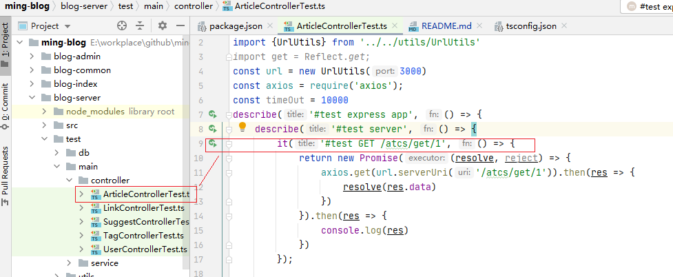
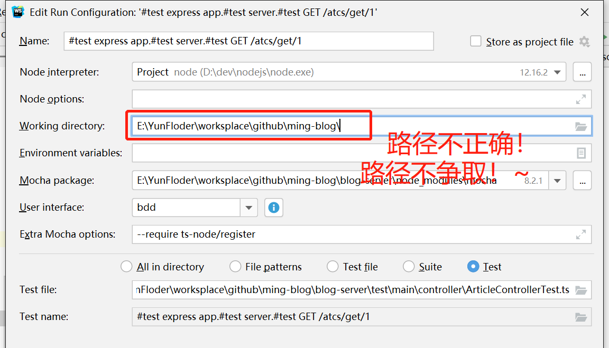
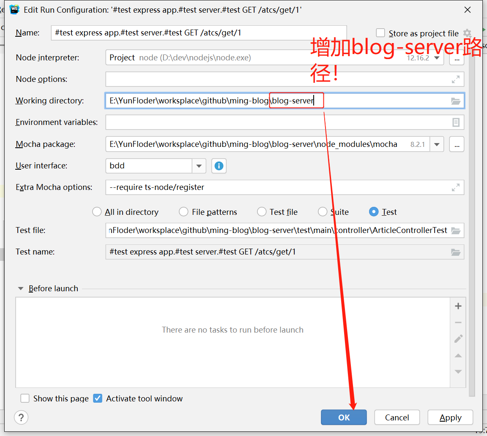
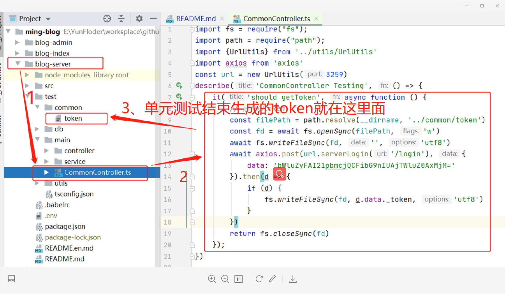

# ming-blog

> Introduction

A more complex Blog site project.The project is divided into three parts by the front end and back end separation technique.
* blog-admin：Blog background management
* blog-index：Blog front desk presentation
* blog-server：Blog API interface service

## Announcements

**Why isn't my Mocha unit test running?**
* **Precondition**: Always install `typescript` first; it is recommended that you install it in a global manner: `npm i typescript -g`
* **Project Environment**: `win10`
* **Idea Developer Tools**: `Webstrom`
* **API Unit Tests Classes**: `ming-blog/blog-server/test/main/controller/ArticleControllerTest.ts`
* **Mode Of Operation**:Use the Webstrom unit test class for quick startup

> **Solution**：
> 
> 

> TIP : 
>   Since the latest code contains JWT login authentication, to test the test case in `blog-server/test/`, 
>   run the login unit test in `blog-server\test\main\ commonController.ts` 
>   in order to get the latest `token` saved locally (`blog-server\test\common\token`)
> 
