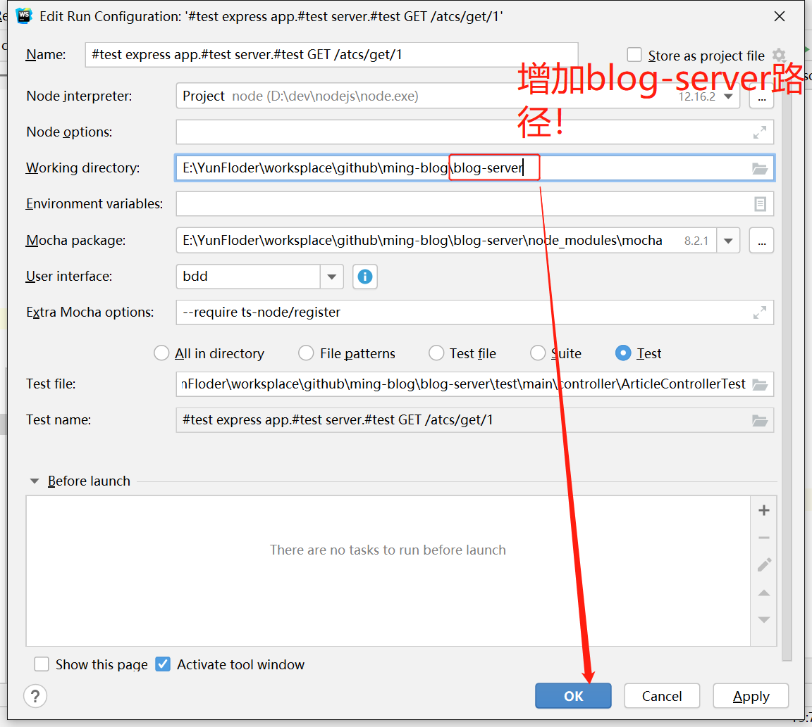

# ming-blog

## TIP

1.项目刚发布，有许多文档没有写，大家有问题（任何问题）都可以在 [issue](https://github.com/varlinux/vue-typescript-blog/issues) 中提出

2.项目目前架构为 **单页应用**，所以打开耗时会比较长，还请耐心等待。（注：目前正在重新架构 ssr ，具体可关注：[https://github.com/varlinux/var-blog-index](https://github.com/varlinux/var-blog-index)）

3.网站部分功能并未完善

4.网站 bug 较多，有些已经排列在 **任务栏** 中，有些还未发现。可提 [Issue](https://github.com/varlinux/var-blog-index/issues)

# 项目

- 前台线上地址：http://varlinux.com/index
- 后台管理线上地址：http://varlinux.com/admin

## 效果图

### 前台

### 后台

# 描述
一个主要使用Vue + + Typescript + Express + Node技术开发的项目，数据库用到了Mysql + MongoDB.
技术栈：
* 前端：Vue2.x + Vuex + Vue-Router + Element
* 后端：Node + Typescript + Express + Mongodb + Mysql + axios + log4j + jsonwebtoken + multer（MVC模式）

一个较为复杂的Blog网站项目。通过前后端分离技术将项目分为三部分：
* blog-admin：Blog后台管理
* blog-index：Blog前台展示
* blog-server：BlogAPI接口服务

## 启动方式

1、启动本地的`nginx`（端口为`8080`，目的是启动本地图片路径代理）

2、分别启动
* `blog-admin`中执行`npm run dev`（开发模式）
* `blog-index`中执行`npm run dev`（开发模式）
* `blog-server`中执行`npm run server`（开发模式）

## 注意事项

### 1、为什么我的Mocha单元测试运行不了呢？
* **前提条件**：一定要先安装`typescript`，建议最好用全局方式安装：`npm i typescript -g`
* **项目环境**： `win10`
* **Idea开发者工具**： `Webstrom`
* **API单元测试类**： `ming-blog/blog-server/test/main/controller/ArticleControllerTest.ts`
* **运行方式**：使用webstrom单元测试类快捷启动方式

> **解决方法**：
> 
> 

> TIP : 
>   由于最新代码里面包含jwt登录验证，如若想要测试`blog-server/test/`中的测试用例需要先运行
>   `blog-server\test\main\CommonController.ts`中的登录单元测试，其目的是为了获取获取最新的`token`
>   保存在本地(`blog-server\test\common\token`)
> 
>

### 2、开发环境下如何确保图片上传正常使用？
> 为了更加真实模拟图片服务器，本项目**开发环境**下采用`[nginx]()`独立代理图片目录方式
#### 操作步骤
##### 下载ngxin安装包，链接：[http://nginx.org/en/download.html](http://nginx.org/en/download.html)
##### 安装包下载完，只要解压到自定义的目录即可

windows：nginx使用方式：

**启动：**

方式一：双击上述图片的`nginx.exe`

方式二：首先进入压缩后的目录（上述图片`D:\Dev\Server\nginx\nginx-1.19.6\nginx-1.19.6`），使用`cmd`命令行：`start nginx` 

**查看：**

方式一：启动的`nginx`可以通过`windows`任务栏

方式二：使用命令：`tasklist /fi "imagename eq nginx.exe"`

**结束**

方式一：直接在任务栏中鼠标右键`结束任务`即可（nginx可能存在多个进程，尽量把所有的任务都结束掉；nginx进程还可能存在依赖关系，可能需要先需要结束某个进程其他进程方可结束）

方式二：在当前解压目录，使用：`nginx -s stop`即可结束（此种方式启动可能在任务栏中不能查看到）

##### nginx启动配置
- 进入解压目录，找到`conf`目录，打开`nginx.conf`文件：

- 校验成功启动（出现`403`即表示启动成功）：

> TIP：如果启动失败，请查看解压目录下的`logs`文件夹的`error.log`查找原因
